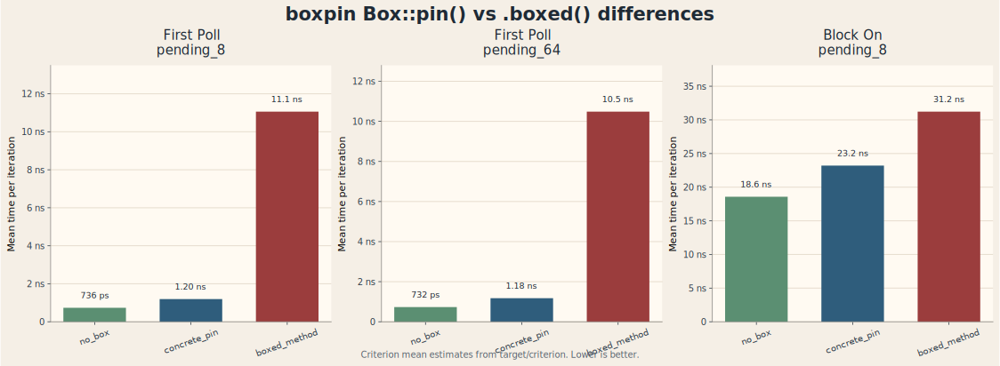
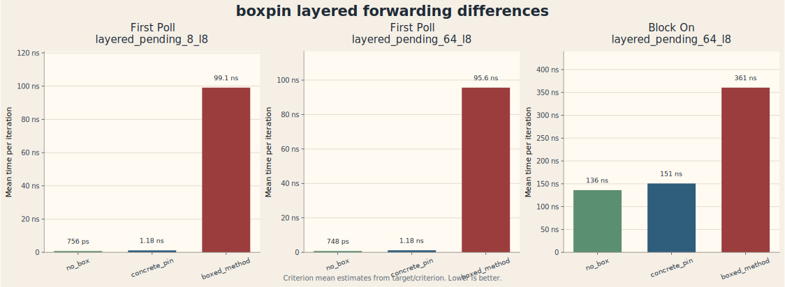

### TLDR

`.boxed()` from the `futures` crate reads beautifully at the end of an `async` block, but it's not free: it performs type erasure and hands you a `BoxFuture`, which means every poll goes through dynamic dispatch.

I got curious enough to actually measure it. The runtime overhead of dynamic dispatch is real, but I wondered how real, depending on the context, use case, etc.

So I shipped a tiny crate called [`boxpin`](https://crates.io/crates/boxpin) that gives you the suffix ergonomics of `.boxed()` while doing exactly what `Box::pin(...)` does and nothing more:

```rust
use boxpin::BoxPinExt;

let future = async { 42 }.pinned();
```

No type erasure or dynamic dispatch. Same type, same cost as `Box::pin(future)`, and full inlineability.

## Why I started poking at this

`Box::pin(...)` is what you actually want, most of the time. You have an `async fn` or an async block, the compiler tells you the future isn't `Unpin`, you box-pin it and move on.

But syntactically `Box::pin(...)` is a *prefix*. It wraps the whole expression. If you're chaining async builders or returning a future from inside a `match` arm, you have to backtrack and add an opening paren way up top. It's annoying. And IMO super unreadable.

`.boxed()` is a *suffix*. It reads top-to-bottom. You write the future, then say `.boxed()` and you're done. Beautiful.

The catch: `.boxed()` does more than `Box::pin`. It also performs type erasure. The return type is `BoxFuture<'static, T>`, which expands to `Pin<Box<dyn Future<Output = T> + Send + 'static>>`. That `dyn` is the part that costs you. Every poll is a vtable lookup, and the compiler can no longer inline through the boundary.

> **Quick refresher on type erasure.** When the compiler sees a concrete future type, it can inline the body, fold combinators, and reason about the call as if it were ordinary synchronous code. As soon as you hide that type behind `dyn Future`, all of that goes away. The future becomes a black box behind a function pointer.

The question I wanted answered: how much does that nicer-looking call actually cost?

## What the benchmark actually does

The full harness lives at [github.com/ae2rs/boxpin](https://github.com/ae2rs/boxpin). It's Criterion, with seven scenarios (`immediate_ready`, `pending_8`, `pending_64`, `large_capture_4k`, `combinator_chain_16`, plus two layered families) measured at five life-stages: `construct`, `first_poll`, `complete_manual`, `block_on`, and inside both flavours of the Tokio runtime.

Every scenario compares the same future under three strategies:

```rust
// 1. no_box: the raw future, baseline
let f = make_future();

// 2. concrete_pin: Box::pin, no type erasure
let f = Box::pin(make_future());

// 3. boxed_method: futures::FutureExt::boxed, with type erasure
let f = make_future().boxed();
```

`concrete_pin` is what `.pinned()` does in the `boxpin` crate. `boxed_method` is the `.boxed()` from the `futures` crate.

I'm not benchmarking allocation cost here. Every strategy that boxes pays for one `Box::new`, so that part cancels out. The interesting cost is what happens *after* the future is built: the polls.

> **Setup.** All numbers below come from `cargo bench` (release mode, with Criterion's defaults: 30 samples, 500ms warmup, 1s measurement). Lower is better.

## Headline chart: the basic scenarios



A few things jump out.

On `first_poll`, the picture is clean. For `pending_8`, the raw future takes about **736 ps**, `concrete_pin` is **1.20 ns**, and `boxed_method` jumps to **11.1 ns**. That's a roughly **9x** slowdown versus the un-erased pin. `pending_64` looks almost identical: 732 ps / 1.18 ns / **10.5 ns**. The first-poll cost barely depends on how much work the future will eventually do, because we're only paying for the dispatch into the future, not for the future's body. The erased version pays for a vtable call; the concrete one inlines.

Once you switch to `block_on`, the runtime starts to dominate. For `pending_8`, the three numbers are **18.6 ns**, **23.2 ns**, and **31.2 ns**. The gap between `concrete_pin` and `boxed_method` shrinks to about 1.3x, because most of the time is now spent waking and re-polling, not in the dispatch itself.

This is what I expected: erasure cost is per-poll, and it shows up most clearly when per-poll work is small.

## Where it really hurts: layered/middleware stacks

The flat numbers are interesting but easy to brush off. The picture gets a lot more dramatic when you stack futures inside futures.

The layered scenarios put eight `ForwardLayer<F>` wrappers around a base future. Think of it as a stand-in for tower-style middleware composition, where each layer wraps and forwards to the next. With concrete types, every layer compiles down to a flat call chain. With type erasure at each layer, every layer adds a `dyn Future` boundary, and every poll walks through eight vtable lookups before reaching the leaf.



The first-poll numbers for `layered_pending_8_l8` are **756 ps** (no box), **1.18 ns** (concrete pin), and **99.1 ns** (boxed). That's an **84x** gap between the two boxed strategies. Same shape for `layered_pending_64_l8`: concrete pin is 1.18 ns, boxed is **95.6 ns**, roughly 81x.

The headline numbers are first-poll, but `block_on` on the same eight-layer stack still shows it: 136 ns concrete versus **361 ns** boxed. That's a ~2.4x penalty that no amount of "amortised over a real workload" hand-waving makes go away. If you have an async pipeline with eight middleware layers and every leaf is `.boxed()`, you're paying that cost on every single request.

The mechanism is straightforward: vtable lookups stack additively, the optimiser can't see through the erased boundary, and once the compiler can't see through it, it can't inline, can't reorder, can't fold the layers together. Eight layers of erasure means eight times nothing-the-compiler-can-do.

> **Rule of thumb.** A single `.boxed()` at the edge of your app (where a runtime hands the future off to its executor anyway) is probably fine. A `.boxed()` *inside every layer* of a middleware stack is the case to actually worry about. The cost is per-poll and per-layer, so it multiplies fast.

## The crate: `boxpin`

The fix is almost embarrassingly small. The whole crate is one trait and one method:

```rust
pub trait BoxPinExt: Sized {
    fn pinned(self) -> Pin<Box<Self>>;
}

impl<T: Sized> BoxPinExt for T {
    fn pinned(self) -> Pin<Box<Self>> {
        Box::pin(self)
    }
}
```

A blanket impl over every `Sized` type. Method named `.pinned()` because that's what you actually get back: a `Pin<Box<T>>` where `T` is the concrete, un-erased type.

In use:

```rust
use boxpin::BoxPinExt;

let value = async { 41_u8 }.pinned().await;
assert_eq!(value, 41);
```

`x.pinned()` is exactly `Box::pin(x)`. Same allocation, same return type, same runtime cost. None of the per-poll overhead you saw above. The only thing it adds is the suffix syntax.

It's on crates.io as [`boxpin`](https://crates.io/crates/boxpin), docs at [docs.rs/boxpin](https://docs.rs/boxpin), source at [github.com/ae2rs/boxpin](https://github.com/ae2rs/boxpin). No deps. MIT or Apache-2.0, take your pick.

## What about compile times?

The benchmark above measures one axis: runtime. There's another axis I haven't measured, and which I think might actually go the *other* way.

`.boxed()` collapses monomorphisation at its boundary. The body of the erased future is compiled once, not once per concrete instantiation. In a very large async codebase (one with deeply nested `async fn`s where each one expands into a unique anonymous future type), that collapsing might significantly reduce what the compiler has to chew through. So the same dynamic dispatch that hurts at run time could be helping at build time.

I haven't measured it. It's the kind of thing you'd want to test on a real codebase, not a microbenchmark. Pick a large async project, swap `Box::pin` for `.boxed()` at the boundaries that matter, and time `cargo build` cold and incremental.

> **If you try this**, I'd love to see the numbers. Drop them in an issue on the [boxpin repo](https://github.com/ae2rs/boxpin) and I'll happily fold them into a follow-up.

Maybe that's the next post. For now: if you care about runtime, `.pinned()` is a free win over `.boxed()`. If you care about compile time, the answer is genuinely unclear, and I'd love to see it benchmarked.
